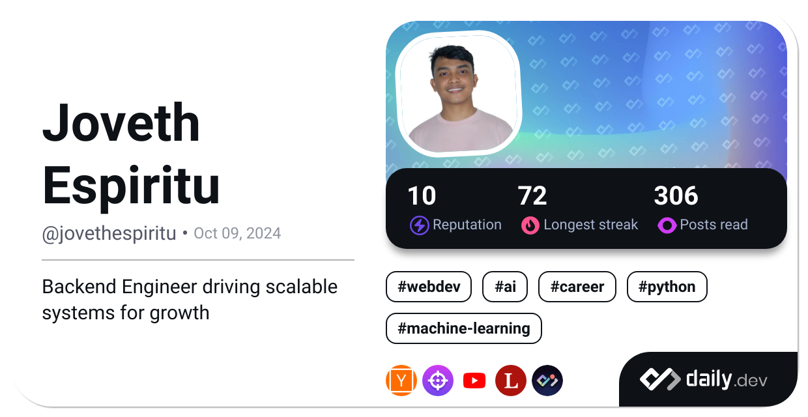

#  Joveth Espiritu 

#### **`Backend Developer — because someone has to make the buttons actually work.`**

[-Follow-white?style=for-the-badge&logo=x&labelColor=black)](https://x.com/JovethDev)

---

## 🚀 About Me
I'm a backend developer focused on building scalable, reliable systems.  
Currently implementing a RESTful backend for an AI-powered chatbot and working toward mastering backend engineering with plans to dive deeper into Go, Docker, and Kubernetes.

---

## 📌 Featured Projects
### **AI Chat Bot Backend**
A RESTful backend that powers an AI-driven chat bot using OpenAI. Designed for businesses to sell products seamlessly using Facebook Pages.

### **Modular Monolith for 3rd-Party Integrations**
A dedicated backend service that handles large-scale integrations for various e-commerce platforms, built as a scalable modular monolith.

---

## 🛠 Tech Stack
**Languages & Frameworks**

**Infrastructure & Tooling**

---

## 📊 GitHub Stats

  
  

---

## 📚 What I'm Reading
- *The Pragmatic Programmer* — Because my code deserves a little wisdom.
- *Tech Articles* — Feeding my brain one byte at a time daily.

---

## 💡 A Fact About Me
- *I like TURTLES!* — They’re like backend code: mostly hidden, but essential. 

---

## 🎯 Goals
- Master backend development  
- Learn **Go (Golang)** and build production-grade backends with it  
- Master DevOps fundamentals (Docker, Kubernetes, etc.)

---
